<p align="center">
  
</p>

<p align="center">
  <a href="https://pedromartins.tech"></a>
  <a href="https://linkedin.com/in/pedro-g-martins"></a>
  <a href="mailto:pegradowski@hotmail.com"></a>
  
</p>

```console
pontope@github:~$ whoami
Pedro Gradowski Martins

pontope@github:~$ cat current_role
DevSecOps & Cloud Security Engineer

pontope@github:~$ uptime --career
3+ years building backend automation, cloud infrastructure and production systems

pontope@github:~$ pwd
Curitiba, Brazil

pontope@github:~$ systemctl is-active curiosity
active
```

I build and operate **secure-by-default production systems** across AWS, Linux and containerized environments. My work lives where security meets delivery: least privilege, secrets management, input validation, hardened infrastructure, traceable operations and automation that survives production.

## `$ ./mission --active`

- **Way-V** — enterprise automation for clients including Hyundai, DHL and JBS with Python, FastAPI, Docker, Kubernetes and CI/CD.
- **BRASILCON** — self-hosted OJS production infrastructure with TLS end to end, containerized services and zero-open-port ingress through Cloudflare Tunnel.
- **Security engineering** — multi-account AWS guardrails, software supply-chain integrity, Linux administration and evidence-driven hardening.

## `$ ls ./flagship-systems`

| System | Signal | Status |
| --- | --- | --- |
| [**AwLZ**](https://github.com/PontoPe/AwLZ) | Multi-account AWS landing zone: Terraform, SCPs, centralized logging/detection and GitHub OIDC | `live / evidenced` |
| [**Provenance Pipeline**](https://github.com/PontoPe/ProvenancePipeline) | SBOMs, vulnerability gates, keyless signing, SLSA provenance and negative controls | `CI verified` |
| [**PortfolioWebsite**](https://github.com/PontoPe/PortfolioWebsite) | Production case studies, security write-ups and an interactive Next.js interface | `production` |
| [**Docker Email Tracker**](https://github.com/PontoPe/docker-email-read-status) | FastAPI, Redis, PostgreSQL and Docker Compose | `open source` |
| [**FintechDemo**](https://github.com/PontoPe/FintechDemo) | Go microservices, authentication, payment flows, PostgreSQL and React | `demo` |
| [**ZombiesWeb**](https://github.com/PontoPe/ZombiesWeb) | Typed content, interactive timelines and a 3D first-person experience | `creative build` |

## `$ cat /etc/toolbox`

<p>
  
  
  
  
  
  
  
  
</p>
<p>
  
  
  
  
  
  
  
  
</p>

<details>
<summary><code>cat /etc/pontope/personality.conf</code></summary>
<br />

- Former competitive CS:GO player; still wired for fast feedback loops and post-match analysis.
- Music lover and builder of strange, playful interfaces.
- Game development started the obsession in Berkeley back in 2017.
- Portuguese native; fluent English; advanced French and Italian; intermediate Spanish.
- Proud slop antagonist: AI is a tool, judgment stays human.

</details>

<details>
<summary><code>./roadmap --show --honest</code></summary>
<br />

- [ ] RHCSA — in progress
- [ ] CompTIA Security+
- [ ] AWS Solutions Architect Associate
- [ ] Certified Kubernetes Administrator
- [x] Keep building systems that produce evidence instead of asking for trust

</details>

<details>
<summary><code>cat ./security-philosophy.md</code></summary>
<br />

1. **Trust no input.** Validate at every boundary.
2. **Default to least privilege.** Access should be narrow, temporary and observable.
3. **Prefer evidence over claims.** Logs, attestations, negative tests and reproducible infrastructure.
4. **Fail safely.** Client-facing errors stay generic; operational detail stays controlled.
5. **Automate the repeatable.** Keep human judgment for the decisions that deserve it.

</details>

## `$ ./telemetry --public-only`

<p align="center">
  
  
</p>

<p align="center"><sub>Public repository telemetry only. Language cards measure repository code, not proficiency.</sub></p>

```console
pontope@github:~$ ./handshake
[ OK ] identity verified
[ OK ] secure defaults loaded
[ OK ] curiosity daemon running
[ OK ] personality module enabled

ACCESS GRANTED_
```

<p align="center">
  <strong>Open to DevSecOps, cloud security, platform security and security-focused backend work.</strong>
</p>

<!-- TODO: Refresh role, certifications, flagship systems, and external card availability as the profile evolves. -->
